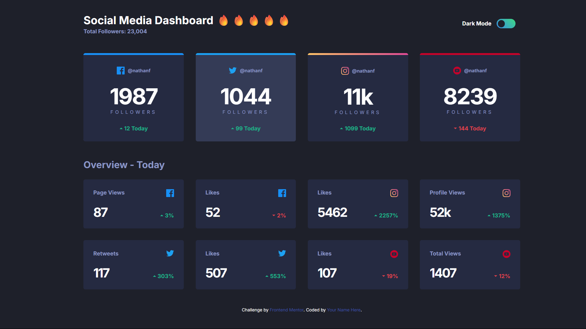
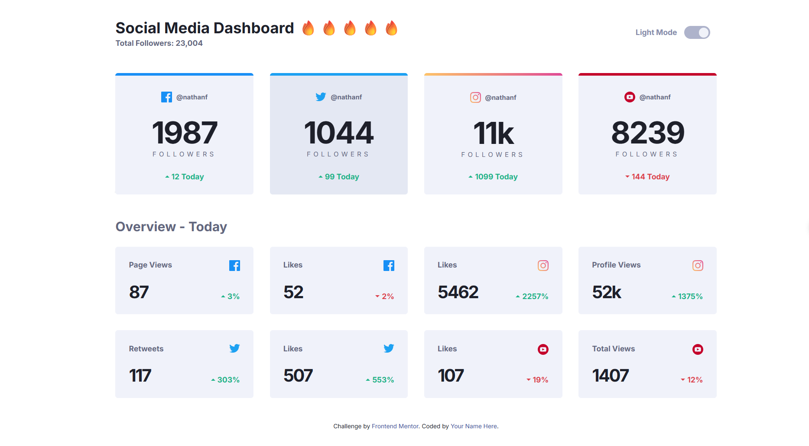

# Frontend Mentor - Social media dashboard with theme switcher


## Struct app
```
APP 
+---js 
|       script.js
| 
\---scss
    |   style.scss
    | 
    +---components 
    |       _index.scss 
    | 
    +---globals 
    |       _index.scss 
    |       boilerplate.scss 
    |       colors.scss
    |       fonts.scss 
    |       layout.scss 
    \---util 
            _index.scss 
            breakpoints.scss 
            functions.scss 
```
## Setup gulp workflow

- You need to gulp-cli
```
    npm install --global gulp-cli
```
- You need to sass module
```
    npm install sass --save-dev
```
- Install gulp in project
```
      npm install --save-dev gulp
```
- Make gulpfile.js
- Install packages in project:
```
    npm install @babel/core @babel/preset-env postcss autoprefixer browser-sync cssnano dart-sass gulp gulp-babel gulp-postcss gulp-sass gulp-terser
```

## Use code
```
npm init -y                     # create npm project
npm install                     # install packages
npm install --global gulp-cli   # install gulp command line 
gulp                            # Run project
```

## Screenshot

### Dark Mode 


### Light Mode
